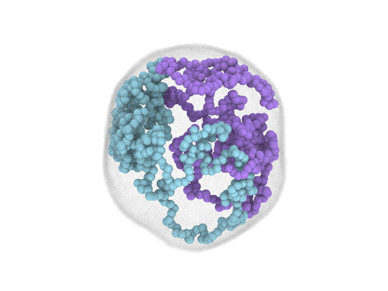

# Contents

- [General description](#general-description)
- [Requirements](#requirements)
- [LAMMPS simulations](#lammps-simulations)
- [Data Analysis](#data-analysis)
- [References](#references)
- [Author](#author)

# General description

Performs coarse-grained molecular dynamics simulations of chromosome segregation using LAMMPS as described in [1] (see in particular the Methods section in the reference for a detailed description of the simulation model and protocol). 

The simulations are analyzed using custom Python scripts (see the [Data Analysis](#data-analysis) section below).

# Requirements

- A Bourne shell compatible “Unix” shell program (frequently this is bash)
- Open MPI version 4.1.2 (with libraries)
- GCC version 11.4.0

- Python version 3.10.12 
- Numpy version 1.25.2
- Scipy version 1.11.1
- scikit-learn version 1.4.1

- [LAMMPS stable release 02/08/2023](https://github.com/lammps/lammps/releases/tag/stable_2Aug2023) (**later version might be incompatible** -- see **Note on neigh_modify exclude and dynamic groups** below)

## Compiling LAMMPS (for Unix-based systems)

(See also: https://docs.lammps.org/Build_make.html)

The LAMMPS simulations require to slightly modify two files in the LAMMPS source code.
These are:

- pair_cosine_squared.cpp
- pair_cosine_squared.h

The modified files can be found in the attached lammps directory.

The following instructions allow to install LAMMPS using make on Ubuntu or other similar Unix-based systems.

1) Download LAMMPS stable version 02/08/2023 tarball from the following page: https://download.lammps.org/tars/index.html

2) Extract the tarball: 

```
tar -xzvf lammps*.tar.gz
```

3) Copy modified files pair_cosine_squared.cpp and pair_cosine_squared.h into lammps-2Aug2023/src/EXTRA-PAIR, replacing existing files.

4) Move into the directory lammps-2Aug2023/src

3) Install additional packages (for example: make yes-rigid)

- ASPHERE  
- EXTRA-COMPUTE 
- EXTRA-MOLECULE 
- EXTRA-PAIR  
- MOLECULE 
- RIGID

5) Install LAMMPS using make: 
	
	make mpi

# LAMMPS simulations

After compling LAMMPS following the steps listed in "Compiling LAMMPS", you should obtain an exectuable lmp_mpi.

## Initial state creation

1) Move into the directory [initial_state_creation](/initial_state_creation)

2) Run python script create_2rings_noangles_connected.py

3) You will obtain a LAMMPS data file **2rings_connected_N500_box140.06.lammpsdata**

4) Run LAMMPS script rings_squeeze_noangles_soft_harmonic_connected.in

5) You will obtain a LAMMPS data file **data.compress**

6) Run python script data_compress_add_mesh_ellipsoid_atom_longbox_upscale_patchypoly.py

7) You will obtain a LAMMPS data file **data_mesh_ylz_patchy_poly_diameter2.00_natoms_sphere6750_lx123.24_ly82.16_lz82.16.lammpsdata** - This is the initial configuration for the mobile phase simulation.

## Mobile phase

1) Move into the directory [mobile_phase](/mobile_phase)

2) Copy the LAMMPS data file **data_mesh_ylz_patchy_poly_diameter2.00_natoms_sphere6750_lx123.24_ly82.16_lz82.16.lammpsdata** (initial state) into the directory.

3) Run LAMMPS script ylz_patchypoly_hc_mobile.in:

	Example: `~/lammps-2Aug2023/src/lmp_mpi -in ylz_patchypoly_hc_mobile.in`

4) You will obtain a LAMMPS data file **data.ylz_patchy_hc_mobile**. Note that, in this file, x axis does *not* coincide with the axis of maximum segregation.

### Choosing the x axis as the axis of maximum segregation

This step is required to ensure that, during the compaction phase, compaction is inhibited in a volume that lays perpendicular to the axis of maximum segregation.

1) From the mobile_phase directory, run the script lda_segregation_patchy.py (see **Data Analysis** below for details).

2) You will obtain a file **last_lda_normal.dat**.

3) Run the script **data_ylz_patchypoly_rotate_xaxis.py**.

4) You will obtain a file **data.ylz_patchy_hc_mobile_rotate_xaxis_lda_norm**. In this file, the x axis coincides with the axis of maximum segregation as determined by LDA. 

## Compaction phase

1) Move into one of the sub directories in the [compaction_phase](/compaction_phase) directory (for example, [fast_compaction](/compaction_phase/fast_compaction))

2) Copy the LAMMPS data file data.ylz_patchy_hc_mobile_rotate_xaxis_lda_norm, generated at the end of the mobile phase simulation, into the directory and rename it "data" (an example file is already present in the directory).

3) Run the LAMMPS input file, for example ylz_patchypoly_hc_compactFast_wetUnif.in:

	Example: .~/lammps-2Aug2023/src/lmp_mpi -in ylz_patchypoly_hc_compactFast_wetUnif.in

4) You will obtain a .lammpsdata file (final state after compaction).

### Note on neigh_modify exclude and dynamic groups

In the compaction phase simulations, compaction is inhibited in a slab-shaped region in the middle of the simulation box, as described in the Methods (see Appendinx / Extended Data in [1]). In order to achieve this, we used dynamic groups [2] within the command `neigh_modify exclude` [3].  Note that this is possible only with LAMMPS stable version **02/08/2023** or older. 
Newer LAMMPS releases (24/08/24 forward) will raise an error if a dynamic group is used in `neigh_modify exclude`:

```
ERROR: Neigh_modify exclude group is not compatible with dynamic groups (../neighbor.cpp:2769)
```

This is because of the possibility of unexcpected behavior when using dynamic groups with `neigh_modify exclude`, as described for example [here](https://matsci.org/t/neigh-modify-exclude-dynamically/57184). However, from testing conducted in the specific case used in our simulations, this *seems to work as expected* in our code. 

A minimal example testing the behavior of `neigh_modify exclude` with dynamic groups can be found in the [neigh_modify_exclude_test](/neigh_modify_exclude_test) folder. Here, we report a simulation of fast compaction with no membrane and no bonds between the polymer beads (so that they behave as a fluid). The width of the "no compaction zone" is tuned via the parameter **width_factor_box**; an example initial configuration, with beads arranged on a lattice, is provided. To generate a different initial congfiguration, use the script [create_patchy_beads_lattice.py](/neigh_modify_exclude_test/create_patchy_beads_lattice.py), and copy/rename the resulting LAMMPS data file to data. The rest of the simulation parameters are the same as those used in the fast compaction simulation, whith a higher epsilon_aa (0.75 instead of 0.25).

Naturally, excluding atoms from neighbor lists and thus changing their interactions based on a dynamically defined group locally violates energy conservation, but our model does not assume that energy is conserved, in the sense that the different interactions are assumed to be regulated by an underlying energy-consuming process.

# Data Analysis

The analysis folder contains three python scripts to perform analysis of the LAMMPS simulations.

1) **membrane_volume_radius_patchypoly.py**

This scripts analyzes the membrane configurations. It approximates the membrane surface using the convex hull method, and returns several quantities:

- natoms.dat: Number of membrane atoms

- hull_radius_av.dat: Mean membrane radius

- hull_volume_vs_time.dat: Membrane volume vs time

- hull_area_vs_time.dat: Membrane area vs time

- hull_radius_vs_time.dat: Membrane radius vs time 

- neigh_distance_vs_time.dat: Mean distance between neighbouring membrane particles vs time

- area_per_bead_vs_time.dat: Mean area per membrane bead vs time (estimate)

2) **lda_segregation_patchy.py**

This script performs LDA analysis on the coordinates of the two polymers and returns the LDA error fraction $f$.
The segregation efficiency can be obtaind as $s=1-2f$, as detailed in the Methods (see Appendix / Extended Data in [1]).
It returns:

- lda_frac_errors_vs_time.dat: Error fraction f vs time
- lda_normal_vs_time.dat: Normal to the LDA plane (segregation axis) vs time (3 components, x,y,z)
- last_lda_normal.dat: Last LDA normal of the simulation

3) **cm_dist_patchy.py**

This script computes the distance between centers of mass (CoMs) of the two polymers. It returns:

- cm_dist_vs_time.dat: Distance between the CoMs vs time
- cm_dist_resc_rmem_vs_time.dat: Normalized (by mean membrane radius) distance between the CoMs vs time
- cm_vec_vs_time.dat: Vector connecting the CoMs vs time (3 components, x,y,z)

# References

[1] Parham, Sorichetti, Cezanne, Foo, Kuo, Hoogenberg, Radoux-Mergault, Mawdesley, Daniels Gatward, Boulanger, Schulze, Šarić, Baum, *Temporal and spatial coordination of DNA segregation and cell division in an archaeon*, [PNAS 122 (42), e2513939122 (2025)](https://doi.org/10.1073/pnas.2513939122) 

**Note**: at pag. 17 of the Extended Data, the value of the polymer bead mass was erroneusly reported as being $1.1m$, where $m$ is the mass of a membrane bead. The actual value of the polymer bead mass is $3.82$. This has no qualitatitive effect on the results reported. Moreover, the value of the polymer bead mass is largely arbitrary and not mapped to any experimentally measured quantity. 

[2] [LAMMPS documentation: group command](https://docs.lammps.org/group.html)

[3] [LAMMPS documentation: neigh_modify command](https://docs.lammps.org/neigh_modify.html) 

# Author

Created by [Valerio Sorichetti](https://vsorichetti.wordpress.com/), [Šarić group](https://andelasaric.com/), [Institute of Science and Technology Austria](https://ista.ac.at/en/home/).

